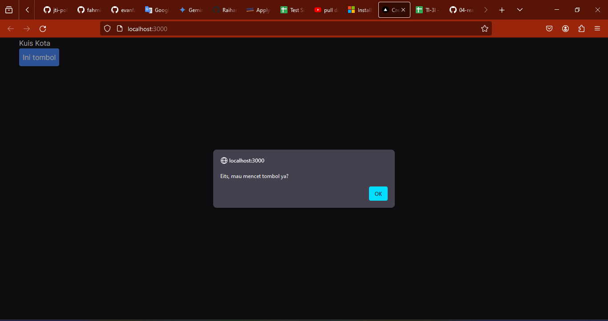
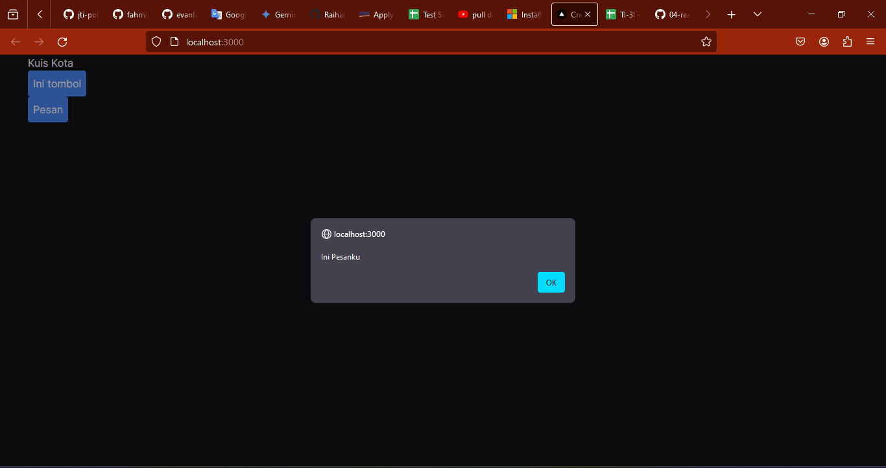
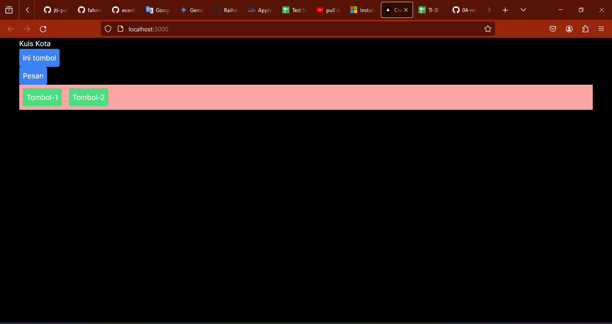
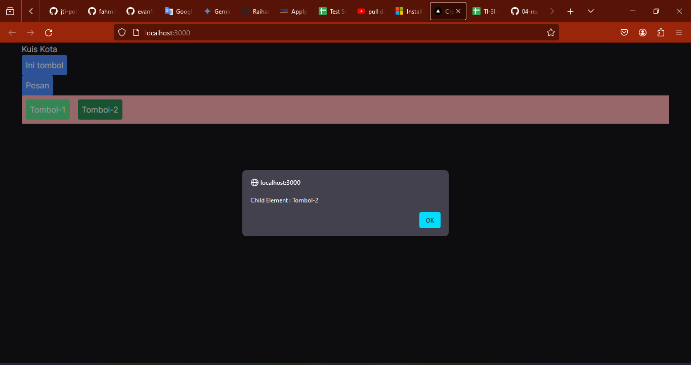
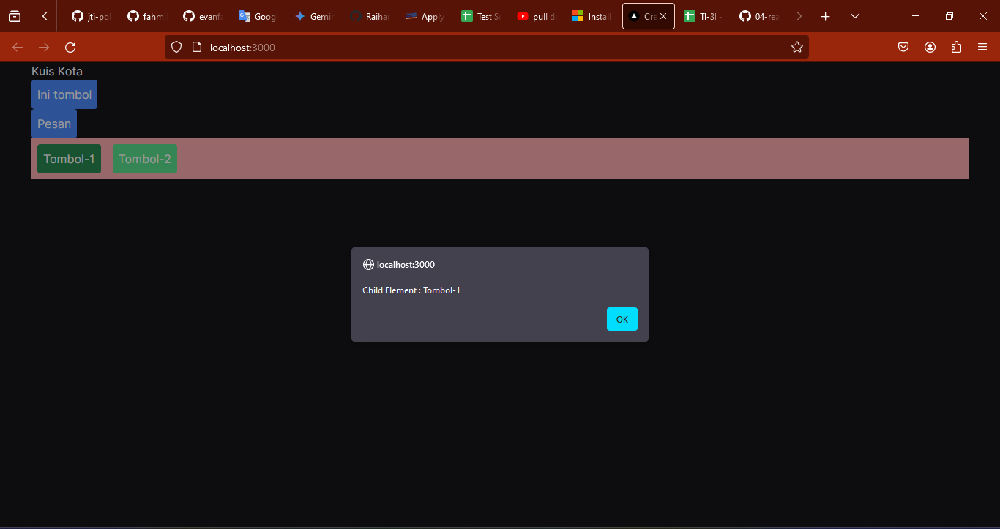
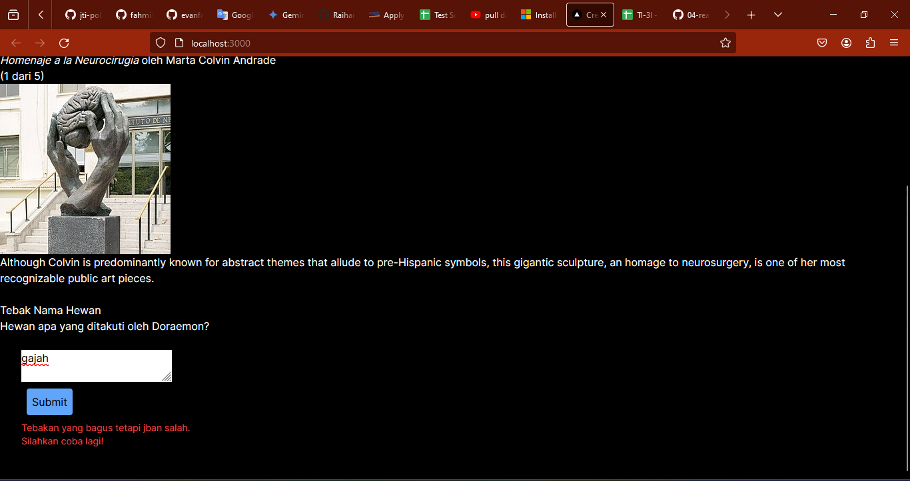
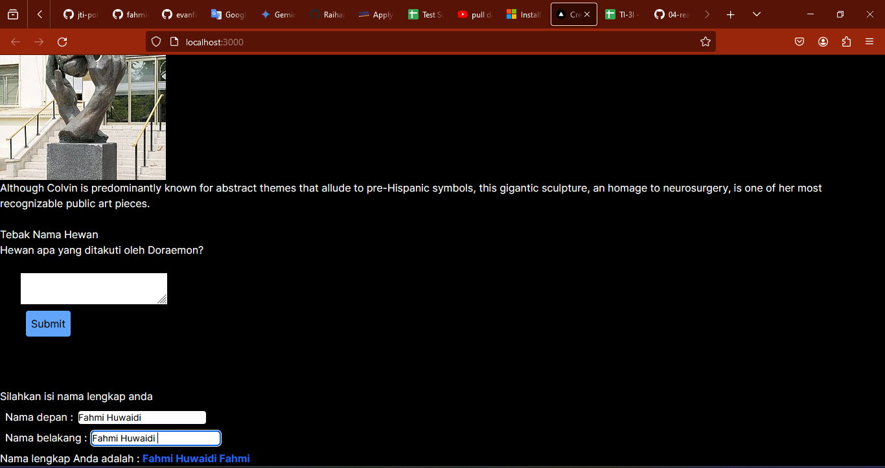

## Laporan Praktikum

|  | Pemrograman Berbasis Framework 2024 |
|--|--|
| NIM |  2141720153|
| Nama |  Muhammad Fahmi Huwaidi |
| Kelas | TI - 3I |

### Jawaban Soal 1

Bukti setup environment telah berhasil di  komputer.

### Jawaban Soal 2

Bukti setup environment telah berhasil di  komputer.

### Jawaban Soal 3

Bukti setup environment telah berhasil di  komputer.

Contoh perubahan.

### Jawaban Soal 4

Bukti setup environment telah berhasil di  komputer.

### Jawaban Soal 5

Bukti setup environment telah berhasil di  komputer.

### Jawaban Soal 2

Bukti setup environment telah berhasil di  komputer.

